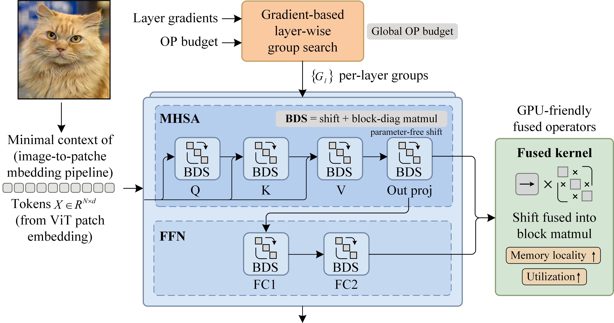

# LiteBDS-ViT



Official implementation of **"Structural Optimization Framework for Efficient Low-Precision Vision Transformers"**.

## Quick Start

### Prerequisites

- Python 3.10
- PyTorch 2.6.0
- `environment.yml`

### Basic Training

```bash
# Train 4-bit quantized DeiT-Small on CIFAR-100
bash ./scripts/cifar/train/train_4bit_cifar_v1_3.sh
```

### Key Training Flags

When you see the following flags in training logs, it indicates the model is searching for optimal block diagonal structures:

```log
--criterion_type block_diag
--learnable_groups
```

## Datasets

- **CIFAR-100**: http://www.cs.toronto.edu/~kriz/cifar.html  
- **Oxford Flowers-102**: https://www.robots.ox.ac.uk/~vgg/data/flowers/102/  
- **Chaoyang**: https://bupt-ai-cz.github.io/HSA-NRL/